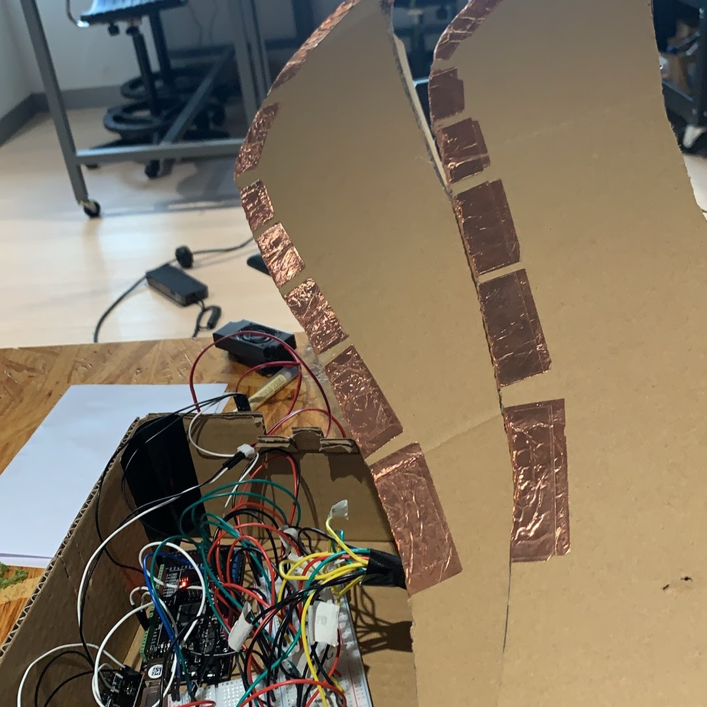
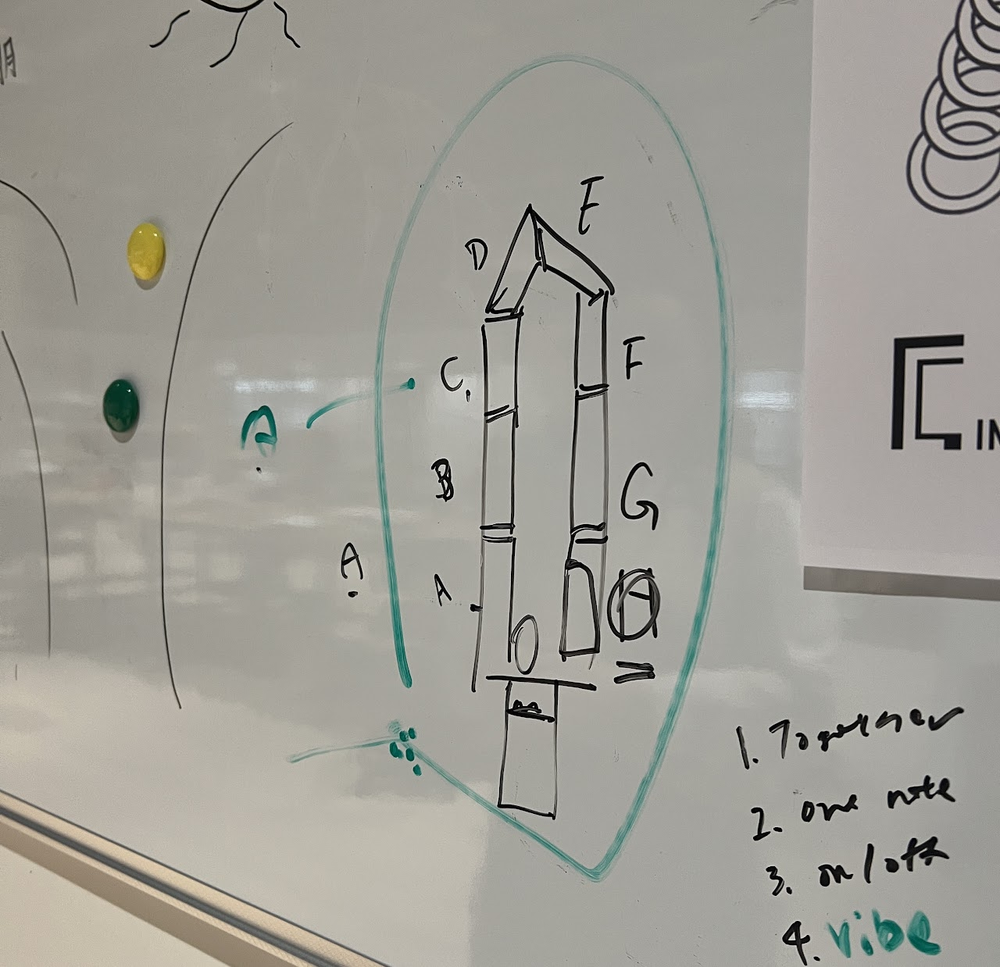
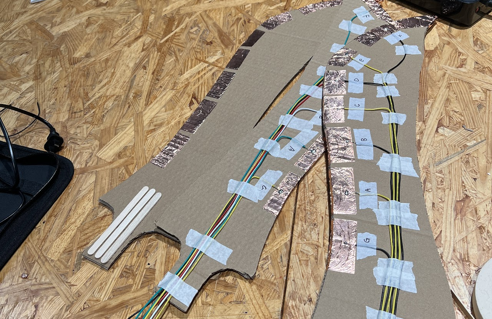
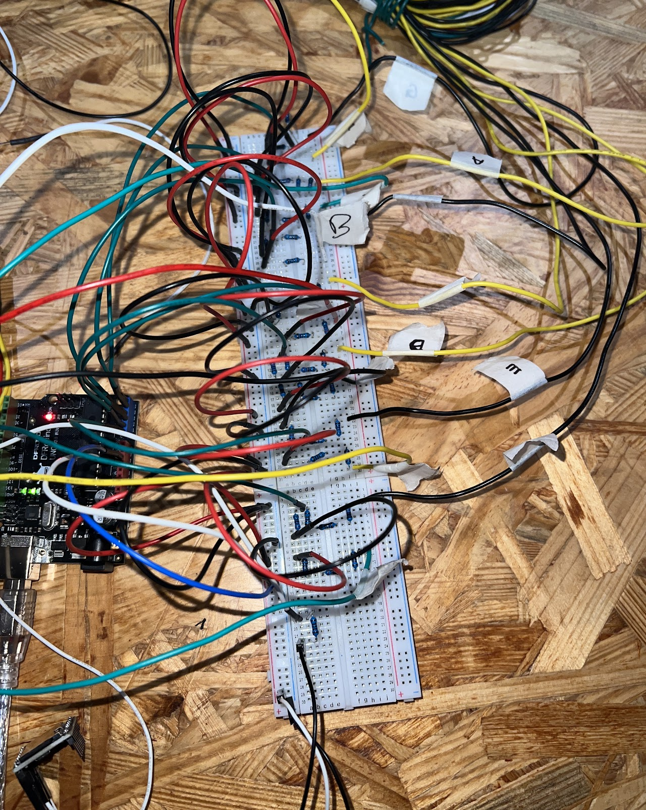

# Musical Swords

An interactive physical computing project that transforms sword collisions into musical input using Arduino.

## Overview

Musical Swords is an interactive installation developed as part of **IX Lab** at New York University, a course centered around physical computing and interaction design.

The project explores how simple embedded systems can create engaging physical experiences by turning a pair of foam swords into a collaborative musical instrument. Instead of using traditional buttons or keys, users generate music through movement—when the swords collide, conductive contact points complete an electrical circuit, allowing an Arduino to detect the impact and play musical notes in real time.

The project emphasized rapid prototyping, hardware iteration, and designing an interaction that felt intuitive and enjoyable rather than building a complex embedded system.

---

## Features

- Arduino-powered embedded system
- Real-time collision detection through conductive contact
- Multi-zone note mapping across the length of each sword
- Custom-built hardware prototype
- Interactive installation designed for collaborative play

---

## How It Works

Each sword contains multiple conductive copper tape segments corresponding to different musical notes.

When conductive segments from opposing swords come into contact, they complete an electrical circuit that is detected by the Arduino. The software identifies which conductive segment was activated, filters unintended repeated triggers through software debouncing, and plays the corresponding musical note through the connected speaker.

This allows the swords to function as a musical instrument controlled entirely through movement and physical interaction.

---

## Hardware

- Arduino Uno
- Cardboard sword prototypes
- Conductive copper tape
- Breadboard and jumper wiring
- Speaker
- Supporting electronic components

---

## Software

The Arduino program is responsible for:

- Monitoring each conductive input channel
- Detecting completed circuits between the swords
- Debouncing collisions to prevent repeated triggers
- Mapping conductive segments to musical notes
- Managing audio playback

---

## Development

The project went through several iterations before arriving at the final prototype.

Early work focused on identifying a sensing method that could reliably detect collisions while keeping the swords lightweight, durable, and safe for repeated use. Multiple wiring layouts and conductive contact designs were explored before settling on the final implementation.

Once collision detection proved reliable, development shifted toward improving responsiveness, minimizing false triggers, and refining the overall interaction experience.

---

## Project Gallery

### Initial Concept

The note layout was planned so that different contact locations along the swords would correspond to different musical notes.

### Prototype Construction

Each sword was constructed from cardboard with pieces of conductive copper tape running along the blade. Every sensing region was individually wired back to the Arduino.

### Internal Electronics

The sensing circuitry, Arduino, and audio hardware were integrated directly into the prototype during development.

---

## Challenges

Some of the primary engineering challenges included:

- Designing a sensing system that could reliably detect impacts without requiring excessive force
- Preventing repeated note triggers from a single collision through software debouncing
- Routing multiple conductive channels through a lightweight handheld prototype
- Balancing hardware simplicity with a responsive user experience

---

## Project Status

**Completed academic project.**

Musical Swords is preserved as a completed portfolio project demonstrating the design and implementation of an interactive embedded system. While no further development is planned, it represents an exploration of physical computing, embedded systems, and interaction design through iterative prototyping.
